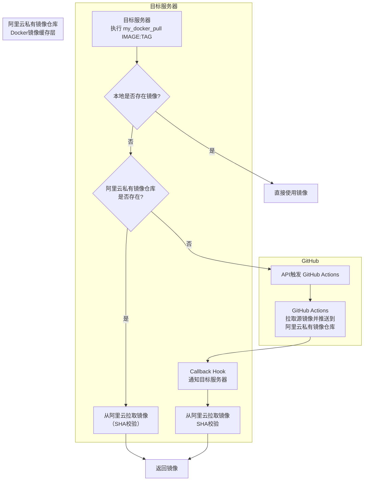

<!--
 * @Author: LetMeFly
 * @Date: 2026-07-31 17:13:20
 * @LastEditors: LetMeFly.xyz
 * @LastEditTime: 2026-07-31 17:43:45
-->
# my_docker_pull

通过github->阿里云私有容器服务->公网服务器的docker pull

## 工作原理

## 致谢

Idea inspeared by [Github@you8023/docker_images_sync](https://github.com/you8023/docker_images_sync/tree/338c58fe2d2b71d124b9dd62dffa6cf4861f0c06)，不同之处在于：

+ 本仓库面向有公网IP但未配置特殊网络的服务器，需要具备公网IP或内网穿透
+ 无需每次产生非feat的commit记录，改用api触发action
+ 改用回调机制，GitHub Workflow推送至阿里云镜像后hook主机，无需每20秒轮询
+ 拉取后校验sha
+ 检查本地及阿里云私有容器服务是否已经存在该镜像，若已存在则不再触发GitHub工作流
