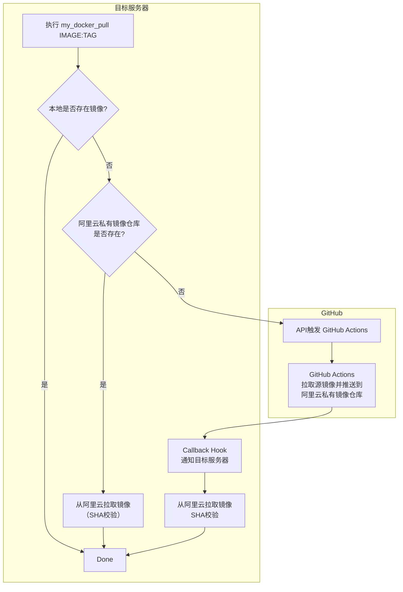

<!--
 * @Author: LetMeFly
 * @Date: 2026-07-31 17:13:20
 * @LastEditors: LetMeFly.xyz
 * @LastEditTime: 2026-08-02 11:24:07
-->
# my_docker_pull

通过github->阿里云私有容器服务->公网服务器的docker pull

## 工作原理



## How to use

[新建](https://github.com/LetMeFly666/my_docker_pull/settings/secrets/actions/new)action环境变量：

+ ALIYUN_DOCKER_USERNAME
+ ALIYUN_DOCKER_PWD
+ ALIYUN_DOCKER_REGISTRY
+ ALIYUN_DOCKER_NAMESPACE
+ SERVER_CALLBACK_URL
+ SERVER_CALLBACK_TOKEN

trigger a workflow:

```bash
curl \
  -X POST \
  -H "Accept: application/vnd.github+json" \
  -H "Authorization: Bearer $GITHUB_TOKEN" \
  https://api.github.com/repos/LetMeFly666/my_docker_pull/dispatches \
  -d '{
    "event_type": "docker-pull",
    "client_payload": {
      "image": "hello-world:latest"
    }
  }'
```

其中`$GITHUB_TOKEN`是[Fine-grained personal access tokens](https://github.com/settings/personal-access-tokens)，需要勾选`Contents`的`Read&Write`权限。

## ToDO

- [ ] 二级路径名
- [ ] re tag
- [ ] rm when failed
- [ ] private registry url支持

## 致谢

Idea inspeared by [Github@you8023/docker_images_sync](https://github.com/you8023/docker_images_sync/tree/338c58fe2d2b71d124b9dd62dffa6cf4861f0c06)，不同之处在于：

+ 本仓库面向有公网IP但未配置特殊网络的服务器，需要具备公网IP或内网穿透
+ 无需每次产生非feat的commit记录，改用api触发action
+ 改用回调机制，GitHub Workflow推送至阿里云镜像后hook主机，无需每20秒轮询
+ 拉取后校验sha
+ 检查本地及阿里云私有容器服务是否已经存在该镜像，若已存在则不再触发GitHub工作流
