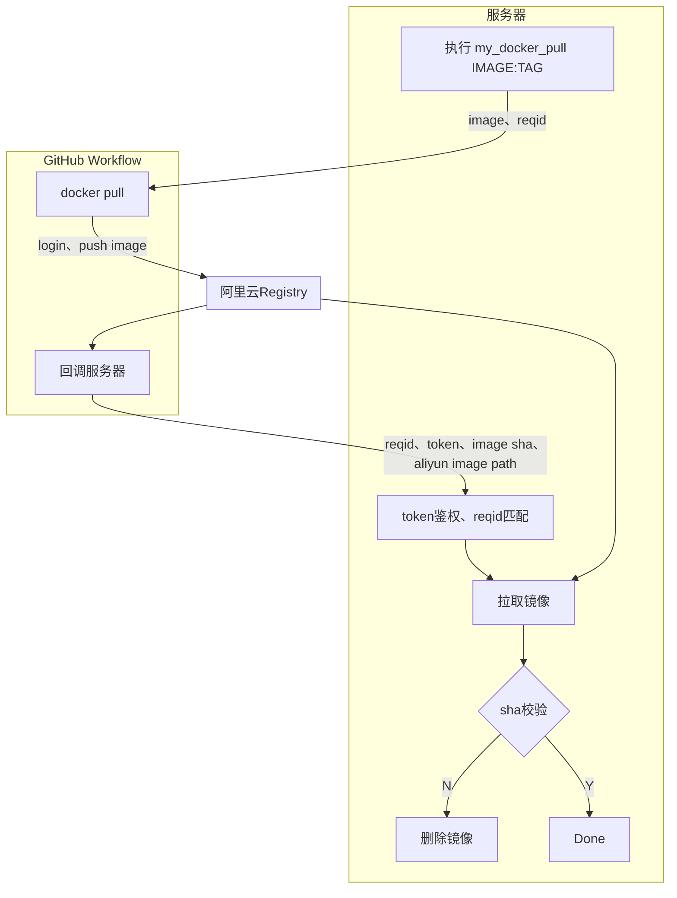

<!--
 * @Author: LetMeFly
 * @Date: 2026-07-31 17:13:20
 * @LastEditors: LetMeFly.xyz
 * @LastEditTime: 2026-08-02 15:02:40
-->
# my_docker_pull

通过github->阿里云私有容器服务->公网服务器的docker pull

## 工作原理



## How to use

[新建](https://github.com/LetMeFly666/my_docker_pull/settings/secrets/actions/new)action环境变量：

+ ALIYUN_DOCKER_USERNAME：你的阿里云主账号用户名
+ ALIYUN_DOCKER_PWD：
+ ALIYUN_DOCKER_REGISTRY
+ ALIYUN_DOCKER_NAMESPACE
+ SERVER_CALLBACK_URL
+ SERVER_CALLBACK_TOKEN

trigger a workflow原理:

```bash
curl \
    -X POST \
    -H "Accept: application/vnd.github+json" \
    -H "Authorization: Bearer $GITHUB_TOKEN" \
    https://api.github.com/repos/LetMeFly666/my_docker_pull/dispatches \
    -d '{
        "event_type": "docker-pull",
        "client_payload": {
        "image": "hello-world:latest"
        }
    }'
```

--aliyun-vpc

hello-world:latest


其中`$GITHUB_TOKEN`是[Fine-grained personal access tokens](https://github.com/settings/personal-access-tokens)，需要勾选`Contents`的`Read&Write`权限。

## ToDO

- [x] 二级路径名 如 （gcr.io/google-containers/pause:latest）
- [x] re tag
- [x] rm when failed
- [x] private registry url支持
- [ ] 最大超时机制？

## 致谢

Idea inspeared by [Github@you8023/docker_images_sync](https://github.com/you8023/docker_images_sync/tree/338c58fe2d2b71d124b9dd62dffa6cf4861f0c06)，不同之处在于：

+ 本仓库面向有公网IP但未配置特殊网络的服务器，需要具备公网IP或内网穿透
+ 无需每次产生非feat的commit记录，改用api触发action
+ 改用回调机制，GitHub Workflow推送至阿里云镜像后hook主机，无需每20秒轮询
+ 拉取后校验sha

本仓库写了依托，欢迎去灵感来源仓库点star。
