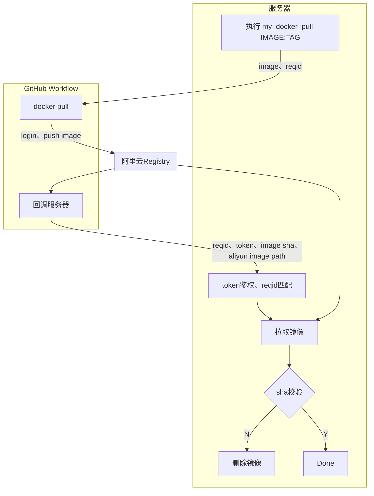

<!--
 * @Author: LetMeFly
 * @Date: 2026-07-31 17:13:20
 * @LastEditors: LetMeFly.xyz
 * @LastEditTime: 2026-08-21 12:12:54
-->
# my_docker_pull

通过github->阿里云私有容器服务->公网服务器的docker pull

## 工作原理



trigger a workflow原理:

```bash
curl \
    -X POST \
    -H "Accept: application/vnd.github+json" \
    -H "Authorization: Bearer $GITHUB_TOKEN" \
    https://api.github.com/repos/LetMeFly666/my_docker_pull/dispatches \
    -d '{
        "event_type": "docker-pull",
        "client_payload": {
        "image": "hello-world:latest"
        }
    }'
```

## How to use

共有3处需要配置

### GitHub

Fork本仓库，[新建](https://github.com/LetMeFly666/my_docker_pull/settings/secrets/actions/new)action环境变量：

+ ALIYUN_DOCKER_USERNAME：你的阿里云主账号用户名
+ ALIYUN_DOCKER_PWD：你的阿里云私有容器服务密码
+ ALIYUN_DOCKER_REGISTRY：你的专属阿里云私有容器地址（域名）
+ ALIYUN_DOCKER_NAMESPACE：你设置的命名空间
+ SERVER_CALLBACK_URL：回调通知服务器镜像准备好了的地址
+ SERVER_CALLBACK_TOKEN：带上这个token服务器才认同

其中`ALIYUN`开头的环境变量见章节[阿里云私有容器服务](#阿里云私有容器服务)，`SERVER`开头的环境变量见章节[服务器](#服务器)

### 阿里云私有容器服务

访问[阿里云私有容器服务](https://cr.console.aliyun.com/cn-beijing/instance/credentials)，若提示未开通则开通一个（Free），得到以下三个环境变量。


点击左侧[命名空间](https://cr.console.aliyun.com/cn-beijing/instance/namespaces)，若还没有就新建一个，名字随意但要记下来，得到另外一个环境变量。


### 服务器

clone该仓库，拿到`my_docker_pull.sh`，赋予执行权限（`chmod +x my_docker_pull.sh`），执行：

```bash
GITHUB_TOKEN="github_pat_2878783787" CALLBACK_TOKEN="26337" /path/to/my_docker_pull.sh "$image_name" 
```

你也可以在`~/.zshrc`或`~/.bashrc`设置alias以达到接近原始`docker pull`的体验：

```bash
alias my_docker_pull='GITHUB_TOKEN="github_pat_2878783787" CALLBACK_TOKEN="26337" /path/to/my_docker_pull.sh'
```

如果你是阿里云服务器，也可以使用内网地址活动更大的带宽，只需要在命令中加上参数`--aliyun-vpc`

如：

```bash
my_docker_pull hello-world:latest
# 或者
GITHUB_TOKEN="github_pat_2878783787" CALLBACK_TOKEN="26337" /path/to/my_docker_pull.sh hello-world:latest --aliyun-vpc
```

其中`$GITHUB_TOKEN`是[Fine-grained personal access tokens](https://github.com/settings/personal-access-tokens)，需要勾选`Contents`的`Read&Write`权限。

其中`CALLBACK_TOKEN`相当于一串你自定义的密码。

## ToDO

- [x] 二级路径名 如 （gcr.io/google-containers/pause:latest）
- [x] re tag
- [x] rm when failed
- [x] private registry url支持

Cando:

- [ ] 最大超时机制？

## 致谢

Idea inspeared by [Github@you8023/docker_images_sync](https://github.com/you8023/docker_images_sync/tree/338c58fe2d2b71d124b9dd62dffa6cf4861f0c06)，不同之处在于：

+ 本仓库面向有公网IP但未配置特殊网络的服务器，需要具备公网IP或内网穿透
+ 无需每次产生非feat的commit记录，改用api触发action
+ 改用回调机制，GitHub Workflow推送至阿里云镜像后hook主机，无需每20秒轮询
+ 拉取后校验sha

本仓库写了依托，欢迎去灵感来源仓库点star。
